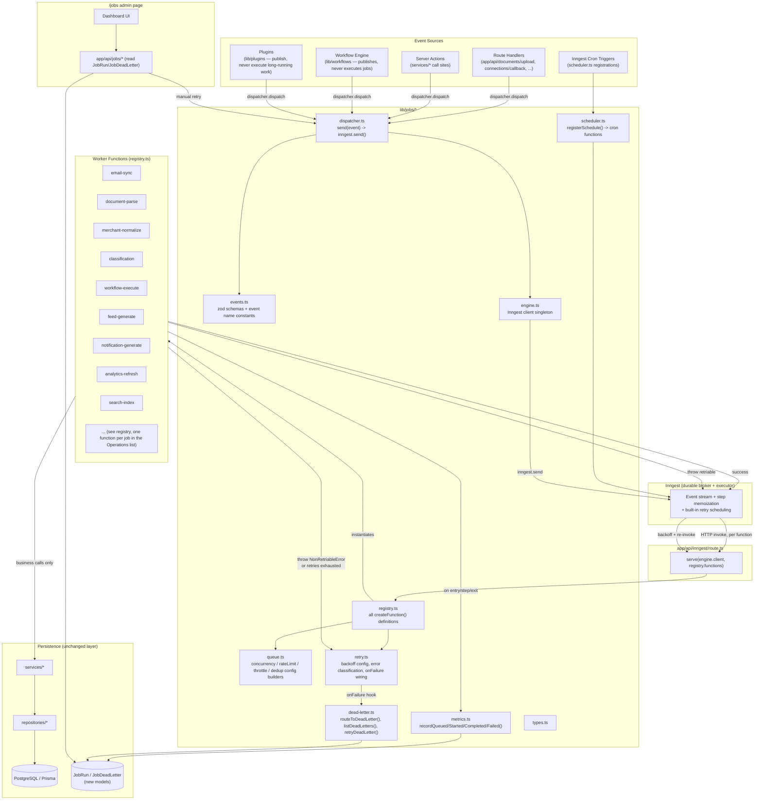

# 1. Background Job Architecture

## 1.1 The core shift

Today, "background work" is either missing entirely or runs synchronously inside a browser client component, blocking the UI and living only in `localStorage`/in-memory state (see [README](./README.md) ground truth). The job platform introduces a durable broker — **Inngest** — between "something happened" and "something expensive runs," so:

- Route handlers, Server Actions, and the Workflow Engine **emit an event and return immediately**.
- Inngest durably stores the event and invokes the registered function(s) that subscribe to it, with automatic retry, backoff, and step-level memoization, entirely outside the request/response cycle.
- Every job writes its own lifecycle state to Postgres (`JobRun`, new model — see [08](./08-worker-architecture.md)) because Inngest's own execution history is not queryable from our app; the `/jobs` dashboard reads `JobRun`, not Inngest's dashboard.

## 1.2 Component map

## 1.3 Event flow, worked example (`EmailImported`)

1. A future `email-poll` cron function (registered by `scheduler.ts`) fires, or a user clicks "sync now" — either way, code calls `dispatcher.dispatch("connection/sync.started", { organizationId, connectionId, providerId })`. The route/action returns to the client immediately (HTTP 202-style response with a `syncJobId`), no waiting.
2. `dispatcher.ts` validates the payload against the zod schema in `events.ts`, calls `engine.ts`'s Inngest client `.send()`, passing an explicit `id` for the event equal to a deterministic dedup key (see [04](./04-queue-strategy.md)).
3. Inngest durably stores the event and invokes the `sync-run` function (defined in `registry.ts`) over HTTP at `/api/inngest`.
4. The function's first step (`step.run("record-job", ...)`) upserts a `JobRun` + `SyncJob` row via `services/sync/sync-job-service.ts`, status `RUNNING`. `metrics.ts` records queue-to-start latency.
5. Subsequent steps page through the provider API (`lib/email/*` glue), calling `services/email/email-import-service.ts::recordEmail` per message — each `step.run` is independently retried/memoized by Inngest if the function crashes mid-way.
6. On completion, the function updates `SyncJob`/`JobRun` to `COMPLETED` and dispatches `email/imported` once per newly-recorded, non-duplicate `EmailRecord` (fan-out, not a loop inside one giant step, so each downstream chain step is independently retryable).
7. A separate function subscribed to `email/imported` runs `document-parse` (if the email had attachments) → dispatches `document/parsed` → a `merchant-normalize` function runs → dispatches `merchant/normalized` → `classification` runs → dispatches `transaction/classified` → `workflow-execute` runs any matching `WorkflowDefinition` → `feed-generate`, `notification-generate`, `analytics-refresh`, `search-index` all subscribe to the terminal events and run independently and in parallel (see [03](./03-job-dependency-graph.md) for the full graph).
8. If any step throws a classified-transient error, Inngest retries per [05](./05-retry-strategy.md)'s backoff config. If retries are exhausted or the error is classified permanent, the function's `onFailure` handler (wired via `retry.ts`) calls `dead-letter.ts::routeToDeadLetter()`, which writes a `JobDeadLetter` row and flips `JobRun.status = "DEAD_LETTER"`.
9. The `/jobs` dashboard queries `JobRun`/`JobDeadLetter` (via a thin `services/jobs/job-service.ts` + `app/api/jobs/*` routes) to show live counts, and can trigger `dead-letter.ts::retryDeadLetter(id)`, which re-dispatches the original event through `dispatcher.ts`.

## 1.4 Why Inngest owns the queue, not us

`lib/jobs/queue.ts` is **configuration**, not a queue implementation — Inngest's own infrastructure is the durable queue, scheduler, and executor. This is a deliberate correction of the two legacy in-memory queues already in the repo (`lib/sync/engine.ts`'s `pumpQueue`, `lib/workflows/runner.ts`'s in-flight `Set`), both of which lose all state on redeploy/cold start and cannot coordinate across serverless instances. See [08](./08-worker-architecture.md) for why this also means there is no long-lived "worker process" to manage on Vercel.
