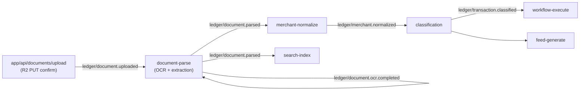
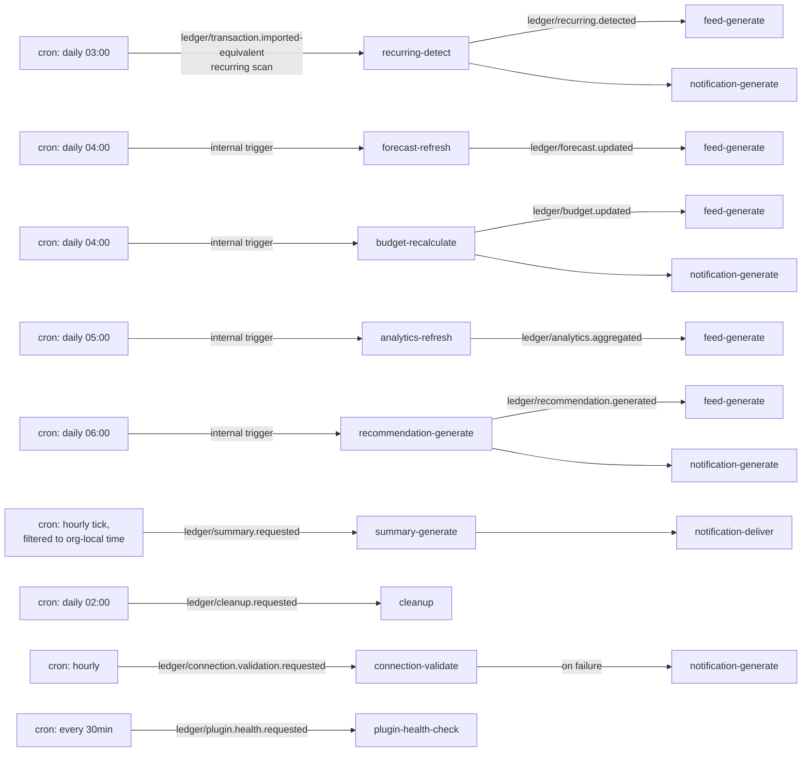

# 3. Job Dependency Graph

## 3.1 Principle

No job ever calls another job's function directly. Every dependency is expressed as "job A's function dispatches event X on completion; job B's function subscribes to event X." This is what makes chains extensible (a new consumer of `ledger/transaction.classified` doesn't require touching `classification`'s function body) and what lets independent branches of a chain run in parallel instead of serially.

## 3.2 The primary chain (email/document → search index)

This is the task's example chain, mapped onto actual event names from [02](./02-event-catalog.md):

```mermaid
flowchart LR
    A["sync-run\n(email)"] -->|ledger/email.imported| B["document-parse\n(if attachments)"]
    B -->|ledger/document.parsed| C["merchant-normalize"]
    A -->|ledger/email.imported\n(no attachments)| C
    C -->|ledger/merchant.normalized| D["classification"]
    D -->|ledger/transaction.classified| E["workflow-execute"]
    D -->|ledger/transaction.classified| F["feed-generate"]
    E -->|ledger/workflow.completed| F
    E -->|ledger/workflow.completed| G["notification-generate"]
    F -->|ledger/feed.generated| G
    D -->|ledger/transaction.classified| H["analytics-refresh"]
    F -->|ledger/feed.generated| I["search-index"]
    D -->|ledger/transaction.classified| I
    H -->|ledger/analytics.aggregated| F
```

Key properties visible in the diagram:

- **Fan-in at `feed-generate`**: it subscribes to `transaction.classified`, `workflow.completed`, and `analytics.aggregated` independently. It does not wait for all three — each triggers its own idempotent upsert (`FeedItem.[organizationId,key]`), so partial fan-in (e.g. classification finishes before analytics) still produces a correct, eventually-consistent feed rather than blocking.
- **`search-index` fans in from two sources** (`feed.generated` and `transaction.classified` directly) because both a transaction and its feed representation are independently searchable objects (`Transaction.searchVector` and `FeedItem.searchVector` both exist in the schema as separate generated columns).
- **`document-parse` is conditionally in the path** — a plain email-derived transaction (no attachment) skips straight to `merchant-normalize`, matching `EmailRecord.fields` already containing enough structured data without OCR.

## 3.3 Document-upload chain

Currently a genuine gap (see [README](./README.md)) — no code path fires anything after upload today:



`ledger/document.ocr.completed` is drawn as a self-loop on `document-parse` — it's an internal Inngest step boundary (OCR provider call → extraction step), not a cross-function event, unless a specific OCR provider requires an async webhook callback, in which case it becomes a real inbound event from `app/api/webhooks/ocr-provider/route.ts` (not designed here — out of scope until an OCR provider is chosen).

## 3.4 Connection / sync chain

```mermaid
flowchart LR
    OAUTH["OAuth callback\n(connections/[provider]/callback)"] -->|ledger/connection.created| SS["sync-start\n(initial)"]
    SS -->|ledger/sync.started| SR["sync-run\n(email-sync or bank-sync,\nrouted by providerCategory)"]
    SR -->|success| SC["ledger/sync.completed"]
    SR -->|permanent failure| SF["ledger/sync.failed"]
    SC --> WFX["workflow-execute\n(sync-completed trigger)"]
    SF --> WFY["workflow-execute\n(sync-failed trigger)"]
    SF --> NOT["notification-generate"]
    CRON["cron: every 15min"] -->|ledger/sync.started\n(runType=SCHEDULED)| SR
    OAUTH -->|ledger/connection.created| WFZ["workflow-execute\n(account-connected trigger)"]
```

`sync-run` is one Inngest function handling both email and bank sync by routing on `providerCategory` internally (rather than two functions racing the same mutex key) — see [04](./04-queue-strategy.md) for why the per-provider concurrency mutex must be shared across both.

## 3.5 Scheduled / cron-originated jobs

These have no upstream job dependency — they originate from `scheduler.ts` cron registrations (full cadence table in [06](./06-scheduling-strategy.md)) — but still fan out through the same event graph once running:



## 3.6 Full dependency table (for implementation reference)

| Job (Inngest function id) | Subscribes to | Publishes | Calls into (`services/*` / `lib/*/engine.ts`) |
|---|---|---|---|
| `sync-start` | `ledger/connection.created` | `ledger/sync.started` | `services/sync/sync-job-service.ts` |
| `sync-run` | `ledger/sync.started` | `ledger/sync.completed`, `ledger/sync.failed`, `ledger/email.imported` (per record) | `services/email/email-import-service.ts`, `services/banks/bank-sync-service.ts` |
| `document-parse` | `ledger/document.uploaded`, `ledger/email.imported` (if attachments) | `ledger/document.parsed` | `services/documents/document-service.ts` |
| `merchant-normalize` | `ledger/document.parsed`, `ledger/email.imported`, `ledger/transaction.imported` | `ledger/merchant.normalized` | `services/merchants/merchant-service.ts`, `lib/merchant/engine.ts` |
| `classification` | `ledger/merchant.normalized`, `ledger/transaction.created` | `ledger/transaction.classified` | `services/transactions/transaction-service.ts`, `lib/ai/classifier.ts` |
| `workflow-execute` | `ledger/transaction.classified`, `ledger/sync.completed`, `ledger/sync.failed`, `ledger/connection.created`, `ledger/connection.disconnected`, `ledger/budget.updated`, `ledger/forecast.updated`, `ledger/recurring.detected`, `ledger/merchant.normalized`, `ledger/recommendation.generated`, `ledger/feed.generated` (mapped to the matching `WorkflowTrigger`) | `ledger/workflow.started`, `ledger/workflow.completed` | `services/workflows/workflow-service.ts`, `lib/workflows/step.ts` |
| `feed-generate` | `ledger/transaction.classified`, `ledger/workflow.completed`, `ledger/budget.updated`, `ledger/forecast.updated`, `ledger/recurring.detected`, `ledger/analytics.aggregated`, `ledger/recommendation.generated` | `ledger/feed.generated` | `services/feed/feed-service.ts`, `lib/feed/engine.ts` |
| `notification-generate` | `ledger/feed.generated`, `ledger/workflow.completed`, `ledger/sync.failed`, `ledger/budget.updated`, `ledger/recurring.detected`, `ledger/recommendation.generated` | `ledger/notification.created` | `lib/policy/engine.ts`, `lib/policy/cooldown.ts` |
| `notification-deliver` | `ledger/notification.created` (where `policyDecision=NOTIFY_IMMEDIATELY`), `ledger/summary.requested` fan-out | — (terminal) | notification delivery channel service (email/push/in-app — to be built alongside this platform) |
| `recurring-detect` | cron (daily) | `ledger/recurring.detected` | `services/recurring/recurring-service.ts::detectAndReconcileRecurring` |
| `forecast-refresh` | cron (daily) | `ledger/forecast.updated` | `lib/forecast/engine.ts::generateForecast`, persisted via forecast repository |
| `budget-recalculate` | cron (daily), `ledger/transaction.classified` (debounced — see [04](./04-queue-strategy.md)) | `ledger/budget.updated` | `services/budgets/budget-service.ts`, `lib/budget/engine.ts` |
| `analytics-refresh` | cron (daily) | `ledger/analytics.aggregated` | analytics aggregation service (existing `/analytics` page's data source) |
| `recommendation-generate` | cron (daily) | `ledger/recommendation.generated` | `services/decision/decision-service.ts`, `lib/decision/engine.ts` |
| `search-index` | `ledger/transaction.classified`, `ledger/feed.generated`, `ledger/document.parsed` | `ledger/search.indexed` | `lib/index/builder.ts` |
| `semantic-index` | same as `search-index` | `ledger/semantic.indexed` | AI embedding pipeline (provider-dependent, follows `lib/ai/provider.ts`'s existing multi-provider pattern) |
| `summary-generate` | `ledger/summary.requested` | (writes `BriefingDeliveryLog`) | `lib/policy/scheduler.ts` timing logic, feed/coach data assembly |
| `cleanup` | `ledger/cleanup.requested` | — (terminal) | repository-level bulk deletes (sessions, audit logs, expired recommendations, dismissed feed items) |
| `connection-validate` | `ledger/connection.validation.requested` | `ledger/connection.disconnected` (if invalid) | `lib/connections/health.ts`, `lib/connections/token-manager.ts` |
| `plugin-health-check` | `ledger/plugin.health.requested`, `ledger/plugin.installed`, `ledger/plugin.enabled` | — (writes `PluginRegistryEntry.health`) | `services/plugins/plugin-service.ts` |

This table **is** `registry.ts`'s design spec — implementation should produce one `createFunction` per row.
