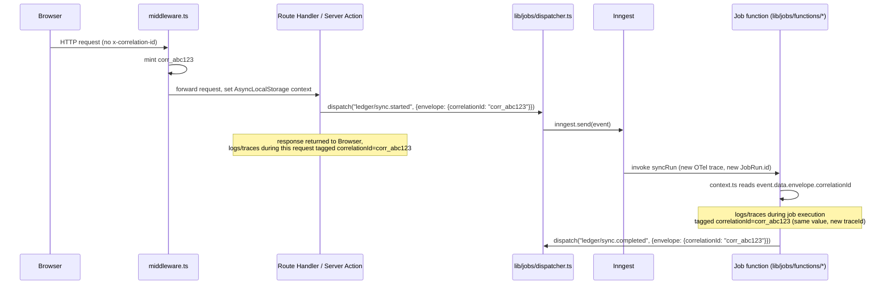

# 09 — Correlation ID Strategy

## Why this is separate from `traceId`

`traceId` (OpenTelemetry) identifies one distributed trace and is generated fresh by the OTel SDK per root span. It does **not** survive an Inngest job boundary as the same value — when a Route Handler dispatches an event and Inngest later invokes a job for it, that job execution starts a **new** trace (Inngest's execution model gives no mechanism to propagate an in-process OTel context across that asynchronous, platform-managed gap). `correlationId` is the application-level identifier that *does* survive that gap, deliberately independent of any tracing backend, so that "everything that happened because of this one user action" can be reconstructed even across trace boundaries, tool changes, or a tracing backend outage.

## Where correlation IDs already exist in this codebase

`lib/jobs/events.ts`'s event envelope already carries `correlationId: z.string()` on **every** one of the 20+ event schemas (`ledger/transaction.created`, `ledger/sync.started`, `ledger/workflow.trigger`, etc.) — this was built into the job platform from the start (per `docs/job-platform/` design docs), anticipating exactly this phase. **This design does not invent a new field; it defines who generates the value that already flows through that field, and extends propagation to cover HTTP requests and logs/traces, which the job platform's `envelope.correlationId` alone doesn't reach.**

## Generation rule

A correlation ID is minted **once**, at the outermost boundary of a unit of work, and threaded through everything triggered by it:

| Origin | Where minted | Format |
|---|---|---|
| Incoming HTTP request (Route Handler or page navigation) | `middleware.ts`, if no `x-correlation-id` request header is present | `corr_{crypto.randomUUID()}` |
| Server Action invocation | Same as above — Server Actions run in the same request context; the correlation ID minted (or received) by `middleware.ts` for that request is available via `context.ts`'s `AsyncLocalStorage` | Inherited, not re-minted |
| Inngest event dispatch (`lib/jobs/dispatcher.ts`'s `dispatch()`) | Inherits the current request's correlation ID from `context.ts` if dispatched from within a request; mints a fresh one only if the dispatch originates from a scheduled/cron job with no upstream request (e.g. `recurringDetect`) | Inherited when available, else `corr_{crypto.randomUUID()}` |
| Scheduled/cron-triggered jobs (`lib/jobs/functions/scheduled.ts`) | Minted fresh at the top of the scheduled function, since there is no upstream request | `corr_{crypto.randomUUID()}` |
| A job that dispatches further sub-events (e.g. `syncStart` → `syncRun`, `workflowExecute` → dependent jobs) | Inherited from the parent job's `event.data.envelope.correlationId`, not re-minted | Inherited |

Mint logic lives in `lib/observability/context.ts` as a single `getOrCreateCorrelationId()` function — every producer (middleware, dispatcher, scheduled-job entry points) calls this one function rather than each independently deciding when to generate a new ID.

## Propagation

- **HTTP → Server Action → Inngest dispatch**: same correlation ID throughout, carried via `AsyncLocalStorage` in-process and via the event envelope across the dispatch boundary.
- **Inngest job → sub-job**: the envelope's `correlationId` is read from `event.data.envelope` and copied into any events the job itself dispatches (already structurally required by the existing zod schema — this design just mandates that `dispatcher.ts` never lets a call site omit it, e.g. by making `correlationId` required with no default in `dispatch()`'s public signature except the inherited-or-minted resolution above).
- **Job → logs/traces**: `lib/jobs/worker.ts`'s `defineJob()` wrapper (already the single choke point for all 20 job functions, per [04-tracing-strategy](./04-tracing-strategy.md)) extracts `correlationId` from the event envelope and sets it in `context.ts`'s `AsyncLocalStorage` for the duration of that job execution, so every `logger()` call and span attribute inside the job automatically carries it — no per-job-function code changes needed.
- **Response header**: Route Handlers echo the correlation ID back as an `x-correlation-id` response header, so a client-side error report (browser console, a support ticket) can be matched to server-side logs without the user needing to know what a trace ID is.

## Relationship to `requestId` and `traceId`

| ID | Scope | Generated by | Survives Inngest boundary? |
|---|---|---|---|
| `requestId` | One HTTP request/response cycle | `middleware.ts`, always fresh per request | No — narrower than correlation ID on purpose |
| `traceId` | One OTel trace (one request's spans, or one job's spans) | OTel SDK | No — a new trace starts per Inngest invocation |
| `correlationId` | One logical unit of work, however many requests/jobs/traces it spans | `context.ts`'s `getOrCreateCorrelationId()` | **Yes** — this is its entire purpose |

A single user action (e.g. "click reconnect on a bank connection") might produce: 1 `requestId` (the Server Action call), 1 `traceId` for that request, then a dispatched `ledger/connection.created` event carrying the same `correlationId`, consumed by `connectionValidate` (a new `JobRun.id`, a new `traceId`, the same `correlationId`). Querying logs/traces by `correlationId` reconstructs the full picture; querying by `traceId` alone would only show one piece of it.

## `AsyncLocalStorage` implementation note

`lib/observability/context.ts` uses Node's built-in `AsyncLocalStorage`, not a module-level mutable variable — Vercel Fluid Compute reuses warm function instances across **concurrent** invocations, so a plain module-level `let currentCorrelationId` would leak between concurrently-executing requests on the same warm instance. `AsyncLocalStorage.run()` scopes the context correctly per logical execution, which is exactly the guarantee needed here.
