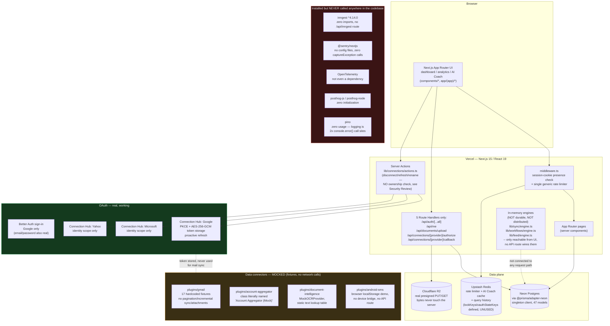
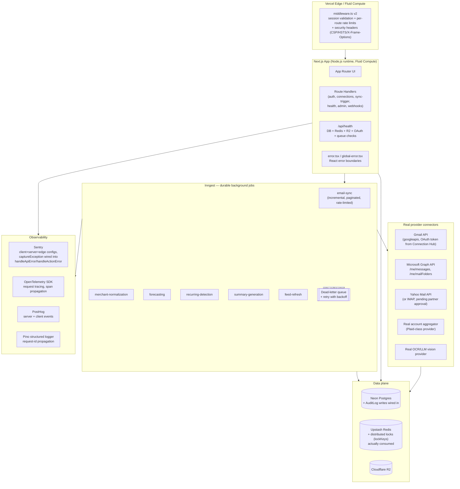

# 1. Production Architecture

Two diagrams: what the architecture **is today** (verified by code inspection), and what it **must become** for production launch. The gap between them is the rest of this document set.

## 1.1 Current-state architecture (as built)

**Reading this diagram:** the green box (OAuth mechanics) is production-grade. The amber box (connectors) has correct shapes and interfaces but fake data behind them. The red box is the most consequential: five infrastructure capabilities the launch requirements explicitly call for (background jobs, error tracking, tracing, product analytics, structured logging) do not exist in the running system today, regardless of what `package.json` implies.

## 1.2 Target production architecture

## 1.3 What changes to get from 1.1 to 1.2

| Capability | Today | Target | Tracked in |
|---|---|---|---|
| Background jobs | Custom in-memory engine, not durable, not reachable from any API route | Inngest functions with retry + DLQ | [05](./05-launch-checklist.md), [06](./06-risk-assessment.md) |
| Email connectors | Fixture data | Real Gmail/Graph/Yahoo API clients with pagination, incremental sync, attachment download | [05](./05-launch-checklist.md) |
| Observability | None wired | Sentry + OTel + PostHog + Pino, all emitting | [05](./05-launch-checklist.md) |
| Security headers | None | CSP, HSTS, X-Frame-Options, per-route rate limits | [03](./03-security-review.md) |
| Health/admin | None | `/api/health`, admin dashboards | [05](./05-launch-checklist.md) |
