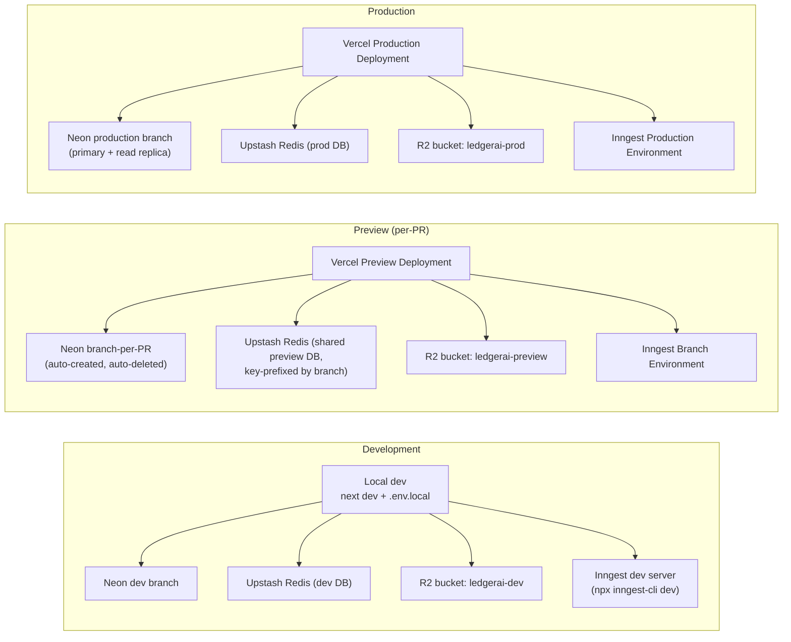
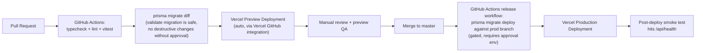

# 2. Deployment Architecture

## 2.1 Platform mapping

LedgerAI already has a linked Vercel project (`.vercel/project.json`: `ledgerai`, org `team_LOEZefvMAz4uCmv4TzXcujCJ`). No `vercel.ts`/`vercel.json` exists yet, so build/route/header/cron configuration is entirely implicit (Vercel + Next.js defaults). The Vercel CLI is **not installed locally** — install it (`npm i -g vercel`) before doing any env sync or preview-deploy work in this workstream.

## 2.2 Environment separation requirements

Every one of these is currently a single set of values in `.env.local` with no environment-specific branching logic anywhere in code. This must change before preview deployments are safe to expose:

| Concern | Dev | Preview | Prod | Current state |
|---|---|---|---|---|
| `DATABASE_URL` / `DIRECT_DATABASE_URL` | Neon dev branch | Neon branch-per-PR (Neon's Vercel integration supports this natively) | Neon prod branch, pooled | Single value, no branching |
| `KV_REST_API_URL/TOKEN` | Dev Upstash DB | Shared preview DB, **must key-prefix by deployment** to avoid cross-PR collisions (rate limiter, AI Coach cache, query history all currently un-prefixed) | Prod Upstash DB | Single DB, no prefixing — a bug found in one preview's cache is invisible in another's |
| R2 bucket | `ledgerai-dev` | `ledgerai-preview` | `ledgerai-prod` | Single bucket name via env var — fine as long as each env sets its own |
| Inngest | Dev server (`inngest-cli dev`) | Branch Environment | Production Environment | **N/A — Inngest isn't wired at all yet** |
| OAuth redirect URIs | `http://localhost:3000/api/connections/{provider}/callback` | Vercel preview URL per deployment (Google/Microsoft/Yahoo all require **exact** redirect URI registration — preview URLs are non-deterministic per deployment) | `https://<prod-domain>/api/connections/{provider}/callback` | Only one redirect URI documented per provider in `.env.example` — **preview OAuth will not work today** without either a wildcard-friendly proxy redirect or disabling OAuth connection testing on preview |
| `BETTER_AUTH_URL` | `localhost:3000` | must be set per-preview-deployment dynamically | prod domain | Static value only |
| Sentry environment tag | `development` | `preview` | `production` | N/A — Sentry not configured |
| PostHog project | dev project or disabled | preview project or disabled | prod project | N/A — not configured |

**Preview-environment OAuth is the sharpest edge case here.** Google/Microsoft/Yahoo all validate the redirect URI exactly. Vercel preview URLs are per-deployment and unpredictable. Two standard fixes: (a) register a stable preview subdomain (e.g., `preview.ledgerai.app` behind a Vercel alias) and proxy all preview deployments through it, or (b) disable live OAuth connection testing in preview and rely on mocked connector fixtures there (the mocks already exist — ironically, preview is exactly where the current mock connectors are the *correct* choice, and production is where they're the gap).

## 2.3 Environment variable validation

No env schema exists (`lib/env.ts` or equivalent — confirmed absent). Every module validates its own env vars lazily at first call (`lib/storage/r2.ts`, `lib/cache/redis.ts`, `lib/connections/providers.ts`), and `lib/db/prisma.ts` reads `DATABASE_URL` with **no check at all** — a missing value fails inside the Neon driver with an opaque error, not a clear boot-time message.

**Required before launch:** a single `lib/env.ts` using Zod to validate the full `process.env` shape at module load (fails fast, at build/boot time, with a legible error naming the missing variable) for: `DATABASE_URL`, `DIRECT_DATABASE_URL`, `KV_REST_API_URL`, `KV_REST_API_TOKEN`, `R2_ACCOUNT_ID`, `R2_ACCESS_KEY_ID`, `R2_SECRET_ACCESS_KEY`, `R2_BUCKET`, `R2_ENDPOINT`, `BETTER_AUTH_SECRET`, `BETTER_AUTH_URL`, `BETTER_AUTH_GOOGLE_CLIENT_ID/SECRET`, `GOOGLE_OAUTH_CLIENT_ID/SECRET`, `MICROSOFT_OAUTH_CLIENT_ID/SECRET`, `YAHOO_OAUTH_CLIENT_ID/SECRET`, `CONNECTION_HUB_ENCRYPTION_KEY`, `INNGEST_EVENT_KEY`, `INNGEST_SIGNING_KEY`, plus Sentry/PostHog DSNs once those are wired.

## 2.4 Build & release pipeline (target)

None of this exists today (`package.json` has only `dev`/`build`/`start`/`lint`/`format`/`test`; no `.github/` directory at all). Target pipeline, detailed further in the [Launch Checklist](./05-launch-checklist.md):

Also required: a `postinstall` script running `prisma generate` (currently missing — `@prisma/client` is generated to a custom output path `src/generated/prisma`, so a fresh `npm install` without an explicit generate step leaves the app unable to build).

## 2.5 Domains & TLS

Not yet configured (no custom domain referenced anywhere in the repo). Vercel handles TLS automatically once a domain is attached; `BETTER_AUTH_URL` and all OAuth redirect URIs must be updated to the final domain before launch, and Google/Microsoft/Yahoo OAuth consent screens (currently presumably in "testing" mode, unverified — confirm via each provider console) need to move to production/verified status, which for Google in particular requires a privacy policy URL that **does not yet exist** (see [05](./05-launch-checklist.md) legal section).

See [08 — Infrastructure Inventory](./08-infrastructure-inventory.md) for the full service/account list and [09 — Go-Live Plan](./09-go-live-plan.md) for the deployment sequence.
