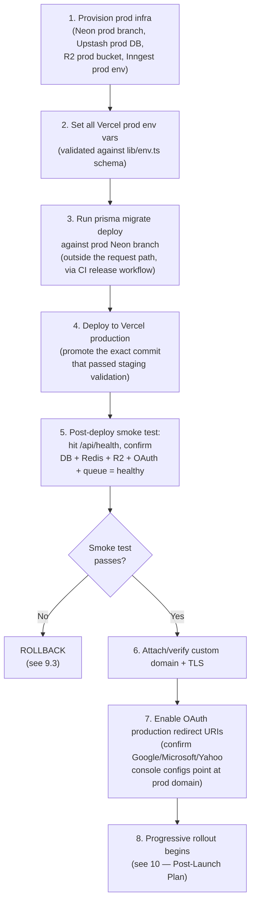

# 9. Go-Live Plan

This assumes all Phase 0-5 work from [07 — Production Readiness Report](./07-production-readiness-report.md) is complete and verified against the [Launch Checklist](./05-launch-checklist.md). This is the deployment sequence itself, not the work to get ready for it.

## 9.1 Pre-flight (T-minus 1 week)

1. Freeze feature work; only launch-blocking fixes merge to `master`.
2. Confirm all Phase 0-5 checklist items are ✅ or have an explicit, signed-off scope exception documented.
3. Confirm Google/Microsoft/Yahoo OAuth apps are in production/verified mode (not testing/sandbox), with redirect URIs pointing at the final production domain.
4. Confirm privacy policy and terms are live at their final URLs before Google OAuth verification is submitted — verification review time must be accounted for in the schedule, not assumed instant.
5. Run a full backup/restore drill against a Neon branch (see [05 — Backups](./05-launch-checklist.md#backups--disaster-recovery)); confirm it succeeds and time it.
6. Run the full test suite, confirm CI is green on `master`.
7. Load test against a staging environment with real (not mocked) connectors, per [04 §4.7](./04-performance-audit.md#47-performance-testing).
8. Confirm Sentry, PostHog, and `/api/health` are live in staging and producing real signal.

## 9.2 Deployment sequence

## 9.3 Rollback procedures

Rollback is planned **per layer**, because a Vercel deployment rollback alone doesn't undo a database migration:

| Layer | Rollback action | Notes |
|---|---|---|
| Application code | Vercel instant rollback to the previous production deployment (Vercel keeps prior deployments live and promotable) | Fastest lever — use this first if the issue is application-level, not data-level |
| Database schema | Only roll back via a **forward-fix migration**, never by reverting to an old deployment against a migrated schema | Prisma migrations are additive-by-default in this workflow; any migration in the release must be reviewed for backward compatibility with the *previous* app version before deploy, so a code rollback doesn't crash against a newer schema |
| Background jobs (Inngest) | Pause/disable affected functions via the Inngest dashboard if a job is causing harm (e.g., a sync job corrupting data) | Confirm this operational lever exists and is documented before launch — don't discover it during an incident |
| OAuth/Connection Hub | If token encryption or refresh logic is implicated, disable new connection creation (feature-flag) while investigating; existing connections' tokens remain encrypted at rest regardless | See [10](./10-post-launch-plan.md) for feature-flag strategy |
| DNS/domain | Revert to a Vercel-provided `*.vercel.app` URL if the custom domain itself is the problem (rare, but a valid last resort) | |

**Rollback decision authority**: name an explicit on-call/incident-commander role before launch (see [10 — Post-Launch Plan](./10-post-launch-plan.md#incident-response)) — this shouldn't be improvised during the first real incident.

## 9.4 Go/no-go criteria

Do not proceed past step 4 in §9.2 unless, in staging, over a representative soak period:
- `/api/health` reports all subsystems healthy
- Sentry shows no unhandled error spikes from the release candidate build
- The full E2E suite (auth, OAuth, CRUD, permissions — per [05](./05-launch-checklist.md#testing)) passes
- At least one real (non-mock) connector sync has been run end-to-end successfully in staging, including a forced-failure test of its retry/DLQ path

## 9.5 Communication plan

- Internal: incident channel and on-call rotation live before go-live, not set up reactively (see [10](./10-post-launch-plan.md))
- External: if this is a public launch with existing waitlist/beta users, define the announcement sequencing separately — that's a product/marketing decision outside this document set's scope, but the engineering readiness gate (this document) should be a hard dependency of that announcement, not run in parallel with it.

See [10 — 30-Day Post-Launch Plan](./10-post-launch-plan.md) for what happens immediately after step 8.
